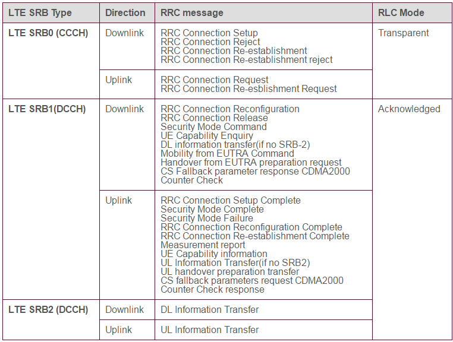

### SRB cheat sheet:

SRB (Signaling Radio Bearer) mapping for LTE Signaling Message

One of the most common mistake we make and spend a lot of time for troubleshooting would be 'Network send some message but does not get any response from UE'. One of the most common reason in this situation (especially when you see the message has gone through L1) would be mismatchs between Signalling message and SRB.

_3GPP 36.331 4.2.2 Signalling radio bearers says :_
**SRB0 is for RRC messages using the CCCH logical channel;** 
**SRB1 is for RRC messages (which may include a piggybacked NAS message) as well as for NAS messages prior to the establishment of SRB2, all using DCCH logical channel;** 

**SRB2 is for RRC messages which include logged measurement information as well as for NAS messages, all using DCCH logical channel. SRB2 has a lower-priority than SRB1 and is always configured by E-UTRAN after security activation.** 

Also 36.331 defines the SRB mapping for each message as shown below. I recommend you to pay attention to these mapping examples. If SRB number does not match between the sender and the reciever, the message would not reach the destination even though the message is properly sent and reach the lower layer of the destination.

####  MasterInformationBlock
1. Signalling radio bearer: N/A
1. RLC-SAP: TM
1. Logical channel: BCCH
1. Direction: E-UTRAN to UE

#### SystemInformationBlockType1
1. Signalling radio bearer: N/A
1. RLC-SAP: TM
1. Logical channel: BCCH
1. Direction: E-UTRAN to UE

#### RRCConnectionRequest
1. Signalling radio bearer: SRB0
1. RLC-SAP: TM
1. Logical channel: CCCH
1. Direction: UE to E-UTRAN

#### RRCConnectionSetup
1. Signalling radio bearer: SRB0
1. RLC-SAP: TM
1. Logical channel: CCCH
1. Direction: E-UTRAN to UE

#### RRCConnectionSetupComplete
1. Signalling radio bearer: SRB1
1. RLC-SAP: AM
1. Logical channel: DCCH
1. Direction: UE to E-UTRAN

#### RRCConnectionReconfiguration
1. Signalling radio bearer: SRB1
1. RLC-SAP: AM
1. Logical channel: DCCH
1. Direction: E-UTRAN to UE

#### MeasurementReport
1. Signalling radio bearer: SRB1
1. RLC-SAP: AM
1. Logical channel: DCCH
1. Direction: UE to E-UTRAN

#### MobilityFromEUTRACommand
1. Signalling radio bearer: SRB1
1. RLC-SAP: AM
1. Logical channel: DCCH
1. Direction: E-UTRAN to UE

#### UECapabilityEnquiry
1. Signalling radio bearer: SRB1
1. RLC-SAP: AM
1. Logical channel: DCCH
1. Direction: E-UTRAN to UE

#### UEInformationRequest
1. Signalling radio bearer: SRB1
1. RLC-SAP: AM
1. Logical channel: DCCH
1. Direction: E-UTRAN to UE

#### DLInformationTransfer
1. Signalling radio bearer: SRB2 or SRB1 (only if SRB2 not established yet. If SRB2 is suspended, E-UTRAN does not send this message until SRB2 is resumed.)
1. RLC-SAP: AM
1. Logical channel: DCCH
1. Direction: E-UTRAN to UE

#### Paging
1. Signalling radio bearer: N/A
1. RLC-SAP: TM
1. Logical channel: PCCH
1. Direction: E-UTRAN to UE

##### IMP notes
**LTE Signalling radio bearers(SRB) are used for the transfer of RRC and NAS signalling messages.**
* **RRC messages** are used as signalling between** UE and eNodeB.**
*  **NAS(Non Access Stratum) message**s are used as signalling between** UE and MME.**

RRC messages can be used **to encapsulate NAS messages** for their transfer between UE and eNodeB. The **S1** application protocol is later used to transfer NAS messages **between eNode and MME.**

As mentioned in the LTE SRB table, there are three types of SRB in the LTE technology.
*  SRB0 used to transfer RRC messages which use CCCH channel.
*  SRB1 used to transfer RRC messages which use DCCH channel.
*  SRB2 used to transfer RRC messages which use DCCH channel and encapsulates a NAS message.

SRB1 is also used to encapsulate NAS message if SRB2 has not been configured.  
SRB2 has lower priority then SRB1 and it is always configured after security activation. 
SRB0 uses transparent mode RLC while SRB1 and SRB2 use acknowledged mode RLC.

[http://www.rfwireless-world.com/Tutorials/LTE-signalling-radio-bearers.html](http://www.rfwireless-world.com/Tutorials/LTE-signalling-radio-bearers.html)
